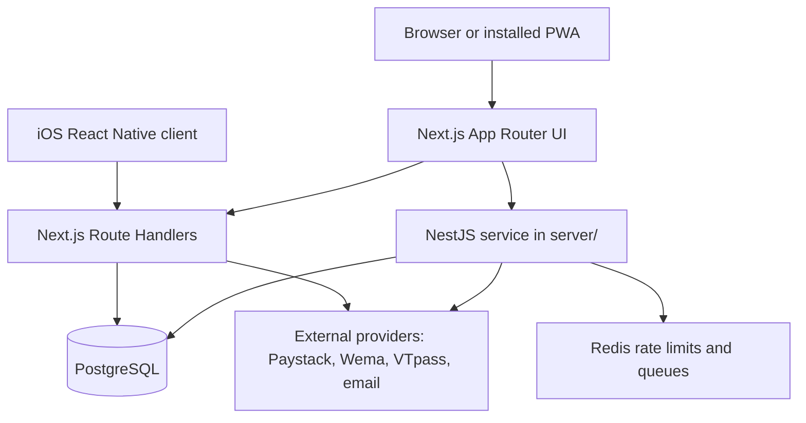

# Me2U architecture and product roadmap

**Reviewed:** 28 September 2026  
**Status:** Repository-based description. Production deployment, credentials, provider approvals, and legal readiness have not been verified by this document.

## Product and platform status

Me2U has a responsive Next.js web app with PWA installation support and a bare React Native iOS client in `mobile/`. The `public/manifest.json`, `public/sw.js`, `components/PwaInstallButton.tsx`, and `components/ServiceWorkerRegistration.tsx` provide the web install/offline shell. Android continues to use this PWA; there is no planned Google Play release.

The iOS project is an initial native client, not a full migration of every web capability. It provides native sign-in, wallet/loan overview, registration Paystack transfer details, and account-deletion request/status screens. It stores bearer sessions in iOS Keychain and calls the existing server APIs. No signed App Store artifact, production signing configuration, privacy declaration, or App Store listing is present yet. Push notifications and Android native code are not planned.

## Current system shape

### Web client

- Next.js App Router in `app/`, React 19, TypeScript, and responsive CSS/Tailwind.
- Zustand slices in `lib/store/` hold client state; server state and authorization remain on API boundaries.
- Shared providers, navigation, service-worker setup, toast feedback, and client error boundary are composed in `app/layout.tsx`.
- The web app is online-first. The service worker provides an offline page and selected static assets; it does not cache financial API responses or enable offline payments.

### Web API and data

- `app/api/**/route.ts` contains Next.js Route Handlers for app workflows, including auth, wallet, loans, marketplace, referrals, savings, onboarding, uploads, health, and webhooks.
- `lib/server/` contains server-side auth, validation, ledgers, provider adapters, logging, and other domain services. Route handlers are the untrusted-input boundary; sensitive ownership and financial decisions must be enforced server-side.
- `lib/railway/client.ts` connects to PostgreSQL. `railway/migrations/` is the ordered migration set used by `npm run db:migrate` (`run-migrations.js`). Never run both `railway/migrations/` and timestamped `migrations/migrations/` manually; reconcile divergence through a reviewed migration change.
- `app/api/health/live` is a liveness response. `app/api/health` reports environment readiness checks. Neither endpoint proves full financial correctness or provider certification.

### Separate service

`server/` is a NestJS application with modules for auth, providers, banking, payments, bills, wallet, transfers, admin, webhooks, and jobs. It uses PostgreSQL and BullMQ/Redis in its code. `AppModule` registers the API controllers and job processors in the same application process; the checked-in deployment config does not define a separate worker command. Production service topology and queue/provider health must be verified in deployment configuration and telemetry; repository documentation alone cannot establish those facts.

### External dependencies

Paystack, Wema, VTpass, email, Redis, and any identity provider are independent failure domains. Each feature must show a recoverable unavailable/error state when its dependency fails. Provider credentials, enablement, certification, webhook configuration, balances, or contracts are not proven by source code.

## Feature status and roadmap

Statuses describe code observed in this repository, not regulatory approval or production readiness.

| Capability                                             | Repository status                                                                                             | Release condition                                                                                                                                   |
| ------------------------------------------------------ | ------------------------------------------------------------------------------------------------------------- | --------------------------------------------------------------------------------------------------------------------------------------------------- |
| Account registration, login, OTP, profile and sessions | Web flows and API routes exist                                                                                | Exercise signup, verification, recovery, session expiry/revocation, abuse limits, and data deletion in staging                                      |
| Wallet, funding, withdrawals and registration deposit  | Web flows, route handlers, ledger and provider-related code exist                                             | Verify provider certification, webhook authenticity, idempotency, reconciliation, refunds/reversals, limits, and support procedures                 |
| Loans, peer marketplace and circles                    | Web routes and API code exist                                                                                 | Verify lender model, eligibility, borrower/lender agreements, payment consistency, disputes, and applicable regulatory approvals                    |
| Savings goals                                          | Web route and screen exist                                                                                    | Verify ledger atomicity, lock/release semantics, access control, recovery, and customer terms                                                       |
| Bills and utilities                                    | Web UI and separate NestJS modules exist                                                                      | Verify enabled providers, job retry/dead-letter handling, idempotency, reconciliation, worker deployment, and customer support                      |
| Referrals, milestones and rewards                      | Web/API and migration code exist                                                                              | Verify reward eligibility, duplicate prevention, ledger settlement, abuse controls, and financial reconciliation                                    |
| KYC, private uploads and security center               | Web/API surfaces exist                                                                                        | Verify production vendor or manual review, retention/access controls, recovery, and each security action end to end                                 |
| PWA                                                    | Manifest, install UI, service worker, and offline page exist                                                  | Test supported browsers/devices, cache upgrade/rollback, accessibility, and offline messaging                                                       |
| iOS native client                                      | Bare React Native project; sign-in, wallet/loan overview, deposit instructions, deletion request/status       | Build on macOS; validate session revocation, privacy/data inventory, lending eligibility, deletion policy, accessibility, signing, and store review |
| Push notifications                                     | Planned                                                                                                       | Specify opt-in, permission timing, unsubscribe, delivery retries, quiet hours, sensitive-content policy, and observability                          |
| Android native application                             | No Play release planned; Android users use the PWA                                                            | Reassess only if a Google Play release is explicitly approved                                                                                       |
| Account deletion                                       | Request/status API and web/native initiation screens exist; execution is not implemented                      | Set the approved `ACCOUNT_DELETION_TARGET_DAYS`, approve a record schedule, and build/review the operator erasure and retention workflow            |
| Biometric login and push notifications                 | Not implemented                                                                                               | Add only after threat/privacy review, secure fallback, opt-in and revocation, and device acceptance are defined                                     |
| Additional country support                             | Readiness configuration exists for several countries; active lending is Nigeria-only in product configuration | Do not enable another country until licensing, local terms, KYC, currency, provider rails, support, and risk controls are approved and tested       |

The visible lists in `lib/product-features.ts` include aspirations and explanatory copy. A label such as “security,” “protection,” or “onboarding” does not establish that every described control exists. Before surfacing a roadmap item as a live security or financial feature, link it to a working API/use case and a testable acceptance criterion.

## Feature delivery contract: contain failures

No software team can guarantee that an app will never crash or that every external service will always be available. The engineering target is to keep a feature failure from corrupting data or taking down unrelated routes, and to provide a safe, understandable recovery path.

Every new feature and roadmap delivery must:

1. **Define its boundary.** Record owner, user journey, dependencies, data sensitivity, authorization rules, failure states, and rollback/disable control before implementation.
2. **Isolate optional work.** Lazy-load or place independently releasable UI behind a feature boundary. Add route-level `error.tsx` and `loading.tsx` where the experience needs independent recovery. Keep a root `global-error.tsx` for failures that escape the root layout.
3. **Fail safely.** Show explicit loading, empty, offline, retry, and unavailable states. Do not turn provider failure into success, fabricate data, or expose stack traces, secrets, or internal provider payloads to users.
4. **Protect financial writes.** Authorize on the server, validate inputs, use database transactions and idempotency where needed, verify external payment state from trusted server evidence, and never automatically replay an ambiguous money-moving request. Reconcile unknown outcomes before a user can create conflicting actions.
5. **Keep releases reversible.** Use backward-compatible expand/migrate/contract database changes; gate risky rollouts; make a verified rollback or forward-repair plan; retain and restore backups before high-impact data changes.
6. **Add tests before release.** Cover success, invalid input, denied access, provider timeout/rejection, duplicate delivery, concurrency, offline/network loss, and recovery. Run focused UI/API integration and end-to-end checks for critical flows in a staging environment.
7. **Observe the feature.** Emit structured server logs, request/correlation identifiers, health signals, and actionable alerts. Never log credentials, tokens, raw financial account data, identity documents, or unnecessary personal information. Add a crash/error reporting service only after privacy and retention are reviewed.
8. **Release in stages.** Keep the feature off or restricted until its gates pass, monitor the rollout, and have a tested disable/rollback path. A client-only hidden control is not authorization.

Current containment includes a React error boundary around the web route content, a Next.js root global error fallback, and a native React error boundary with explicit API/network error states. Native crash telemetry has not been added because its SDK/data collection requires a privacy and retention review. These boundaries are not substitutes for route-level boundaries, server error handling, native crash telemetry, staging evidence, or a no-data-loss financial recovery plan.

## Architecture decisions

**Decision:** Keep the Next.js PWA and APIs as the shared product/backend, and add a bare React Native iOS client for the App Store. Android remains on the PWA.  
**Alternatives:** Package the PWA in a thin webview, or migrate every product surface into native clients.  
**Rationale:** A native iOS client provides secure device integration and app navigation while reusing server-authoritative financial APIs; the web product remains available during staged native delivery.  
**Revisit when:** Android store distribution is explicitly requested, or native/web API boundaries no longer meet product needs.

**Decision:** Treat Nigeria as the only active lending market until another market has a complete release review.  
**Alternatives:** Enable every country listed in locale/currency configuration.  
**Rationale:** Locale formatting is not licensing, underwriting, KYC, payment, or operational readiness.  
**Revisit when:** A country-specific compliance and provider gate is approved and evidenced.

## Repository and operational references

- App routes: `app/`; shared UI: `components/`; client state and product metadata: `lib/`.
- Server utilities: `lib/server/`; PostgreSQL client: `lib/railway/client.ts`.
- NestJS API/worker modules: `server/src/`.
- Migration runner: `npm run db:migrate` → `run-migrations.js` → `railway/migrations/`.
- CI: `.github/workflows/ci.yml`; checks: `npm run check`.
- Deployment and manual operations: `docs/railway-launch-checklist.md`; verify it against deployed Railway/Vercel settings before relying on its steps.
